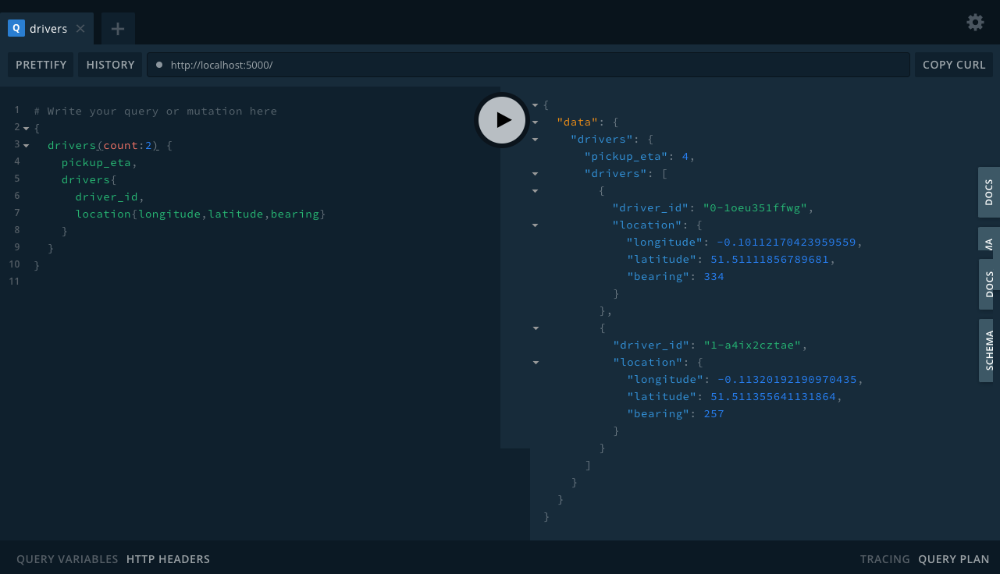

# Taxi Finder GraphQL 🔮
This is a technical practice to write an Apollo GraphQL server to find taxi which get driver data from REST API and serve them on query.

### About ℹ️

This project is to support [Taxi Finder Client](https://github.com/m3yevn/taxi-finder-client/).
The task is to create a graphQL server so that single page Javascript application using React can query from browser.
In order to find the location of local Taxi's, the server will need to contact API,
and get a list of driver locations.
This endpoint will return a list of driver locations, nearby to the location and serve them at graphQL query.

### Tech Stack 📚

 - NodeJS
 - Apollo GraphQL server
 - Apollo REST Datasource
 - GraphQL Playground for schema docs
 - Jest for testing
 
### Note 🌞

Due to CORS issue on the API, it is not able to call API directly from browser client app.
Therefore, this GraphQL server is developed for calling REST API and act as a medium.
Below is the git repository for the client app.

https://github.com/m3yevn/taxi-finder-client/

### How to setup ⚙️

```sh
    $ git clone
    $ npm install
```

### How to run normally 🏃‍♂️

``
    $ npm run start
``

### How to run and watch changes with Nodemon 👀

``
    $ npm run start:watch
``

###### The project should be running on http://localhost:5000

### How to test 🧪

``
    $ npm run test
``

### Screenshot


